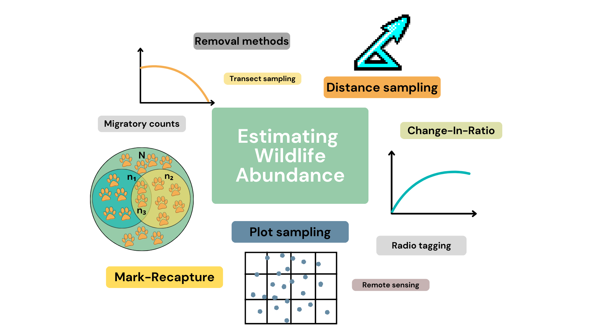

<!-- ```{r setup, include=FALSE} -->
<!--  knitr::opts_chunk$set(echo = TRUE) -->
<!-- ``` -->


```{sass, echo = FALSE}
$color1: #668BA4
$color2: #FEFFDF
div
  &.learnBox
    border-color: $color1
    border-style: solid
    background-color: rgba(151, 203, 169,.5)
    width: 100%
    padding: 0.5em
    border-radius: 10px
    margin: 0 auto 
    strong
      color: $color1
      
      div
  &.defBox
    border-color: $color1
    border-style: solid
    width: 100%
    padding: 0.5em
    border-radius: 5px
    margin: 0 auto 
    strong
      color: black

```

## Introduction 

Understanding wildlife populations is super important when it comes to ecological research and conservation. Specifically, knowing how many individuals make up a population allows us to effectively manage populations and motivate for change in policies and behaviour.  But calculating abundance and density of a population is not that easy, we can’t just go out and count every individual. So over the years, scientists have come up with many different ways to estimate abundance, like plot sampling, removal methods, change-in-ratio, distance sampling, and mark-recapture methods. 
  
```{r,echo=FALSE,out.width="75%",fig.align="center"} 

 
```

The last two methods, distance sampling (DS) and mark-recapture methods (MR) are very popular methods. DS typically relies on spotting animals, whereas MR is an analysis frameworks that can be used in conjunction with a variety of sampling techniques. Originally, MR involved having to physically capture animals, but in recent decades other cool survey techniques such as camera trapping and DNA sampling have been used. But here's the thing: many of those techniques, including visually having to identify animals, can sometimes be quite tricky, a bit pricey and even a little risky. In comes acoustic surveying, a practical and budget-friendly option that might just be the perfect alternative depending on the target population. 

Acoustic surveying, specifically passive acoustic surveying, involves placing microphones or any kind of self-contained recording unit, throughout a marine or terrestrial environment to record animal calls (sometimes called cues or vocalisations). The collected audio data are then processed using various techniques, such as by expert knowledge, machine learning algorithms, or pattern recognition software, to detect the specific sounds of the species of interest. So naturally, this technique can only be used for animals that make identifiable calls. Its an incredibly useful technique for species that aren’t easy to see but do call often, such as the rare and elusive <a href="https://www.youtube.com/watch?v=COQF0ZI0yKY" target="_blank"> vaquita species</a> (a really cute porpoise that is in need of some serious conservation) and many other marine mammals. Or animals that aren't active during the day and regularly call throughout the night, like this <a href="https://animalia.bio/edible-dormouse" target="_blank"> dormouse</a> or this <a href="https://dosits.org/galleries/audio-gallery/fishes/brown-meagre/" target="_blank"> brown meagre</a>. 

There are other benefits to acoustic surveying too. Weather conditions don’t massively dictate surveying, so a cloudy day won’t hinder your ability to spot an animal. For animals that make loud noises, you’ll likely cover a larger area as you’ll be able to record their calls from far away. Automated data collection is easy to implement as you can simply leave recording devices to do their thing, no need to stay out on the field all day. Recent advancements in algorithmic procedures for noise reduction, call recognition and identification have also made automated data processing more efficient and accurate. So, a lot more data can be collected and analysed with acoustic surveying and the more data, the better. Pretty cool right? 


Acoustic surveying lends itself towards the MR framework and consequently, MR models have been developed specifically for data collected from acoustic surveys. In this tutorial, we'll cover these models and how to implement them in R but before that, we need to understand how our ability to detect individuals depends on distance. 


::: learnBox
**What we’ve learned so far:** 

- We need to know how many animals there are in order to effectively conserve wildlife populations
- Two common methods for estimating abundance and density are distance sampling and mark-recapture
- Acoustic surveying is a sampling technique that involves recording animal vocalisations
- Target species must produce calls that are identifiable
- Advantages of acoustic surveying:

1. Relatively inexpensive and straightforward to implement
2. Powerful survey technique for visually cryptic species that produce loud or regular calls
3. Ability to operate independently of light conditions
4. Greater range of detectability 
5. Lends itself towards automated data collection and processing
:::

### Definitions 

**Abundance** is the number of individuals in a population or community.

**Change in Ratio**

**Density** refers to the number of individuals within a certain area or volume. In the context of wildlife populations, it is typically used to describe the number of individuals per unit of habitat.

**Distance sampling** is a statistical method used in ecology to estimate the abundance or density of a population by collecting data on the distances between observers and the individuals they detect.

**Mark-recapture methods**

**Passive acoustic surveying** is when specialised microphones are used to record animal vocalisations. Contrast this to active acoustic surveying where sound sources …. 

**Plot sampling**


**Removal methods**

**Sampling (or survey) technique(s)**

**Self-contained recording unit** is a type of sound recording device used in passive acoustic surveying that is designed to record animal vocalisations. It is typically designed to be left in the field for extended periods of time and may be powered by batteries or solar panels, are often equipped with weather-resistant and durable housing to protect against the elements and wildlife.


<!-- ```{r, echo=FALSE} -->
<!-- shinyApp( -->

<!--   ui = fluidPage( -->
<!--     selectInput("region", "Region:", -->
<!--                 choices = colnames(WorldPhones)), -->
<!--     plotOutput("phonePlot") -->
<!--   ), -->

<!--   server = function(input, output) { -->
<!--     output$phonePlot = renderPlot({ -->
<!--       barplot(WorldPhones[,input$region]*1000, -->
<!--               ylab = "Number of Telephones", xlab = "Year") -->
<!--     }) -->
<!--   }, -->

<!--   options = list(height = 500) -->
<!-- ) -->
<!-- ``` -->


