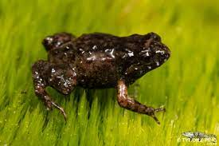

```{r setup2, include=FALSE}

# NB if you want to run the chapter on its own, remove the number after setup in the chunk name 

library(shiny)
library(tidyverse)
library(DT)
library(spatstat)
library(raster)
library(ggimage)
library(shinyWidgets)
library(shinydashboard)
library(mt5751a)

# Setup functions and objects for Shiny App 

# images for plotting
frog_image <- "images/frogGraphic.png"
micro_image <- "images/micro.png"

# Detection function
hazard_halfnormal_detection <- function(sigma, lam0, d) {
  prob <- 1 - exp(-lam0 * exp(-d * (2 * sigma^2)))
  return(prob)
}

# generate capture histories based on detection function 

generate_capt_hist <- function(dataframe, detector) {
  
  # Calculate distance between each point and the detector
  dataframe$distance <- sqrt((dataframe$x - detector$x)^2 + (dataframe$y - detector$y)^2)

  # Define distance intervals and associated probabilities
  distance_intervals <- seq(0, 5, 0.1)
  probabilities <- hazard_halfnormal_detection(1.5, 15, distance_intervals)

  # Create a new column to store the probabilities
  dataframe$prob_succ <- NA

  # Create a new column to store the probabilities
  dataframe$det <- NA

  # Iterate over each row and assign the corresponding probability based on the distance
  for (i in 1:nrow(dataframe)) {
    distance <- dataframe$distance[i]

    # Find the index of the interval where the distance falls
    interval_index <- findInterval(distance, distance_intervals)

    # Assign the probability based on the interval index
    dataframe$prob_succ[i] <- probabilities[interval_index]

    dataframe$det[i] <- rbinom(1, 1, dataframe$prob_succ[i])
  }

  # return capture history
  return(dataframe$det)
}

# Microphone array

# Define the range of x and y
x_range <- seq(1, 4, by = 1)
y_range <- seq(2, 3, by = 1)

# Create the grid of points
microphones <- expand.grid(x = x_range, y = y_range)

```


## Probability of detection

In this tutorial, we assume that our wildlife population is closed. This means that during our survey, we assume that there are no new individuals joining the population (births or immigration) or individuals leaving the population (deaths or emigration). In other words, we assume geographic and demographic closure.  The alternative assumption is that of the population being open, but that requires different analysis which we won’t cover here. Hasn't been developed yet for acoustic? 

Regardless, for both types of models, a key task is to estimate the <span style="color:#668BA4;font-weight:bold;">probability of detection</span>. This is because most surveys of wild populations are inherently **imperfect**.  With only a few exceptions, it is practically impossible to observe every individual in a wild population during a survey. When estimating animal abundance, the probability of detection - that is, the probability that any individual in the population gets detected at all - helps us know how many animal we did not detect. If we know the probability of being in our sample, we automatically know the probability of NOT being in our sample. We have to account for this <span style="color:#668BA4;font-weight:bold;"> imperfect detection</span>, because otherwise our results won’t be realistic or accurate. 


Let's have a look at a traditional mark-recapture analysis with an example. 

### Example: The Cape Moss Frog 

In the Cape Peninsula of South Africa, there is this cool little frog that lives in leaf litter and among thickly vegetated mountain streams and river banks. It’s the perfect specimen for acoustic surveying, because despite the frog being super tiny (about 20-22mm), it can often be heard by its high-pitched call (although some people mistake it for a cricket). 


```{r,echo=FALSE,out.width="35%", fig.align='center'} 

```


Let's imagine that we want to estimate the abundance of this frog population and we decide to place eight microphones throughout a patch of its habitat (see the arrangement below). Let's further imagine that we know the locations of the frogs in that patch (click the "Reveal Frogs" button) and that they each made one call. We may or may not detect (record) each of the calls made and our microphones can detect multiple calls - click the button "Survey!" to see the resulting data collected. 

The table below is a data frame consisting of <span style="color:#668BA4;font-weight:bold;"> capture histories</span>. Each row is a capture history of a call made and indicates at which microphone the call was recorded. An entry equal to "1" indicates that the call (i.e. row) was recorded at that microphone (i.e. column) and if not, the entry will be a zero. Click on one of the rows at it will show you the frog location and the microphones that detected the call. Survey a few times! 

If you've sampled the same set of frogs multiple times, you'll see that most of the time our estimates is lower than the actual number of calls made. In fact, if you click the button "Repeat x 1000", a 1000 surveys of your frog population will be conducted and the resulting 1000 estimates will be visualized as a histogram. 

```{r, echo=FALSE}
fluidRow(
  column(
    6,
    actionButton("addBtn", "Reveal frogs 🐸", style = "color: #fff; background-color: #668ba4; border-color: #2e6da4"),
    actionButton("detBtn", "Survey! 🎙", style = "color: #fff; background-color: #668ba4; border-color: #2e6da4"),
    actionButton("startOverBtn", "Start Over 🔄", style = "color: #fff; background-color: #668ba4; border-color: #2e6da4")
  ),
  column(6,
         actionButton("repeatBtn", "Repeat x 5000", style = "color: #fff; background-color: #668ba4; border-color: #2e6da4"),
         align = "right"
  )
)

fluidRow(
  column(6, plotOutput("plot")),
  column(
    6, dataTableOutput("capt_hist"),
    br(),
    fluidRow(
      valueBoxOutput("trueN", width = 4),
      valueBoxOutput("estN", width = 4),
      valueBoxOutput("probD", width = 4)
    )
  )
)

fluidRow(column(
  12,
  plotOutput("sim_hist")
))
```

```{r, context="server",echo=FALSE}
# Initial plot and empty dataframe

output$plot <- renderPlot({
  ggplot() +
    geom_image(data = microphones, aes(x = x, y = y, image = micro_image), size = 0.3) +
    xlim(0, 5) +
    ylim(0, 5) +
    theme_minimal() +
    theme(
      legend.position = "top",
      legend.title = element_blank(),
      panel.background = element_rect(fill = "#DDE0AB"),
      axis.title = element_blank(),
      axis.text = element_blank(),
      axis.ticks = element_blank(),
      panel.grid.minor = element_blank(),
      panel.grid.major = element_blank()
    )
})

output$capt_hist <- DT::renderDT({
  empty_dat <- matrix(nrow = 10, ncol = 8)
  colnames(empty_dat) <- paste0("M", 1:8)
  
  datatable(empty_dat,
            rownames = TRUE,
            class = "cell-border",
            escape = FALSE,
            extensions = "Buttons",
            selection = "single",
            options = list(dom = "t", ordering = F)
  )
})


# Create a reactive dataframe to store locations of frogs
points <- reactiveVal(data.frame(x = numeric(0), y = numeric(0)))

# Add frogs when the addBtn is clicked
observeEvent(input$addBtn, {
  set.seed(1000)
  window <- owin(c(0, 5), c(0, 5))
  ppp_object <- rpoispp(2, win = window)
  
  x <- ppp_object$x
  y <- ppp_object$y
  new_points <- data.frame(x, y)
  
  points(new_points)
  
  # Render new plot with frogs
  output$plot <- renderPlot({
    ggplot(points(), aes(x = x, y = y)) +
      geom_image(image = frog_image, colour = "#8A3A0D", size = 0.09) +
      geom_image(data = microphones, aes(x = x, y = y, image = micro_image), size = 0.25) +
      xlim(0, 5) +
      ylim(0, 5) +
      geom_text(aes(label = rownames(points())), vjust = 0.5, hjust = 0.5, colour = "white", size = 4, fontface = "bold") +
      theme(
        legend.position = "top",
        legend.title = element_blank(),
        panel.background = element_rect(fill = "#DDE0AB"),
        axis.title = element_blank(),
        axis.text = element_blank(),
        axis.ticks = element_blank(),
        panel.grid.minor = element_blank(),
        panel.grid.major = element_blank()
      )
  })
  
  output$trueN <- shinydashboard::renderValueBox({
    N <- nrow(points())
    shinydashboard::valueBox(N, "Number of calls")
  })
})


# Add points when the button is clicked
observeEvent(input$detBtn, {
  if (is.null(points()) || nrow(points()) == 0) {
    # Display an error if points are empty
    showModal(modalDialog(
      title = "Oops!",
      "Please add frogs before surveying!",
      easyClose = TRUE
    ))
  } else {
    # Calculate probabilities
    prob_hist <- matrix(NA, nrow = nrow(points()), ncol = nrow(microphones))
    for (i in 1:nrow(microphones)) {
      prob_hist[, i] <- generate_capt_hist(points(), microphones[i, ])
    }
    
    
    det_ind <- as.data.frame(prob_hist)
    rownames(det_ind) <- paste("Frog", rownames(det_ind))
    colnames(det_ind) <- paste("M", 1:8)
    det_ind <- det_ind[rowSums(det_ind[, 1:8]) > 0, ]
    
    output$capt_hist <- DT::renderDT({
      det_ind %>%
        DT::datatable(
          rownames = TRUE,
          class = "cell-border",
          escape = FALSE,
          extensions = "Buttons",
          selection = "single",
          options = list(dom = "t", ordering = F)
        ) %>%
        formatStyle(0, target = "row", color = "black", lineHeight = "50%")
    })
    
    
    # Render the plot
    output$plot <- renderPlot({
      dat <- cbind(points(), prob_hist)
      
      det_dat <- dat %>%
        rowwise() %>%
        mutate(
          sum = sum(c_across(3:10)),
          det = ifelse(sum > 0, "Detected", "Not Detected")
        )
      
      det_dat <- det_dat %>%
        data.frame() %>%
        mutate(num = row_number())
      
      
      ggplot(det_dat) +
        geom_image(aes(x = x, y = y, colour = det, image = frog_image), size = 0.09) +
        geom_image(data = microphones, aes(x = x, y = y, image = micro_image), size = 0.25) +
        xlim(0, 5) +
        geom_text(aes(x = x, y = y, label = num), vjust = 0.5, hjust = 0.5, colour = "white", size = 4, fontface = "bold") +
        scale_color_manual(values = c(
          "Detected" = "darkgreen",
          "Not Detected" = "darkred"
        )) +
        theme(
          legend.position = "bottom",
          legend.title = element_blank(),
          panel.background = element_rect(fill = "#DDE0AB"),
          axis.title = element_blank(),
          axis.text = element_blank(),
          axis.ticks = element_blank(),
          panel.grid.minor = element_blank(),
          panel.grid.major = element_blank(),
          legend.text = element_text(size = 12)
        )
    })
    
    output$trueN <- shinydashboard::renderValueBox({
      N <- nrow(points())
      shinydashboard::valueBox(N, "Number of calls")
    })
    
    output$estN <- shinydashboard::renderValueBox({
      ave <- 1 - (1 - mean(prob_hist))^8
      Nhat <- nrow(det_ind) / ave
      shinydashboard::valueBox(round(Nhat), "Estimated number of calls")
    })
    
    output$probD <- shinydashboard::renderValueBox({
      probd <- mean(prob_hist)
      shinydashboard::valueBox(round(probd, 3), "Average probability of detection")
    })
  }
})

# Reset to initial state when "Start Over" button is clicked
observeEvent(input$startOverBtn, {
  points(data.frame(x = numeric(0), y = numeric(0)))
  
  output$plot <- renderPlot({
    ggplot() +
      geom_image(data = microphones, aes(x = x, y = y, image = micro_image), size = 0.25) +
      xlim(0, 5) +
      ylim(0, 5) +
      theme(
        legend.position = "top",
        legend.title = element_blank(),
        panel.background = element_rect(fill = "#DDE0AB"),
        axis.title = element_blank(),
        axis.text = element_blank(),
        axis.ticks = element_blank(),
        panel.grid.minor = element_blank(),
        panel.grid.major = element_blank()
      )
  })
  
  output$sim_hist <- renderPlot({NULL})
  
  output$capt_hist <- DT::renderDT({
    empty_dat <- matrix(nrow = 10, ncol = 8)
    colnames(empty_dat) <- paste0("M", 1:8)
    
    datatable(empty_dat,
              rownames = TRUE,
              class = "cell-border",
              escape = FALSE,
              extensions = "Buttons",
              selection = "single",
              options = list(dom = "t", ordering = F)
    )
  })
  
  output$trueN <- shinydashboard::renderValueBox({
    shinydashboard::valueBox(NULL, NULL)
  })
  
  output$estN <- shinydashboard::renderValueBox({
    shinydashboard::valueBox(NULL, NULL)
  })
  
  output$probD <- shinydashboard::renderValueBox({
    shinydashboard::valueBox(NULL, NULL)
  })
})

# Simualtion

observeEvent(input$repeatBtn, {
  showModal(modalDialog("Hold tight, doing 1000 surveys takes a minute 😮‍💨", footer = NULL))
  simulate_surveys <- function(points, micro, nsims = 1000) {
    nhats <- rep(0, nsims)
    for (i in 1:nsims) {
      # capture histories
      prob_hist <- sapply(1:nrow(micro), function(j) {
        generate_capt_hist(points, micro[j, ])
      })
      
      model <- fit.cr(as.data.frame(prob_hist[rowSums(prob_hist) > 0, ]), model = "M0")
      nhats[i] <- model$Nhat[1]
    }
    
    return(list(nhats = nhats, true = nrow(points())))
  }
  
  data5000 <- suppressWarnings(simulate_surveys(points(), microphones))
  
  output$sim_hist <- renderPlot({
    ggplot(data.frame(nhats = data5000$nhats), aes(x = nhats)) +
      geom_histogram(bins = 10, fill = "#97cba9", colour = "#668ba4") +
      geom_vline(xintercept = data5000$true) +
      theme_minimal() +
      labs(
        x = "\nAbundance estimates",
        y = "Frequency\n"
      ) +
      theme(
        axis.text = element_text(size = 15),
        axis.title = element_text(size = 15)
      )
  })
  removeModal()
})
```

<br/>

Immediately, it is clear the peak of the histogram is relatively far away from the true value, which tells us that on average our estimate is smaller than the actual number of calls made. If you're familiar with statistical terminology, we have shown through simulation that our estimate is negatively biased. We don't want this! Remember, our example is on a very small and arbitrary scale. In reality, concluding that your population is much smaller than what actually exists, could lead to mislead decision-making and consequently, misplaced conservation efforts. 

So, what's happening here? Well, the basic MR model assumes constant detection probability, so essentially we are assuming that each call is equally likely to be detected. But is that true? If you have surveyed a few times, you'll see that frogs that are closer to the microphones are almost always detected and frogs that are within short distances to multiple microphones get detected multiple times! The calls made by those frogs are more likely (i.e. higher probability of detection) to be recorded than those far away. That means that detection probability depends on distance, more specifically detection probability decreases with increasing distance. Let's look at this in a bit more detail. 


### Distance dependent detection 


So our analysis needs to incorporate the relationship between detection probability and distance, and we do this by specifying a detection function. This is where spatial capture-recapture comes in! 

::: learnBox
**What we’ve learned so far:** 

- Wildlife surveys are imperfect, we will never observe all the individuals of a population during a survey - this is known as imperfect detection. 
- For reliable abundance and density estimates, we must estimate the probability of detection (the probability that any individual in the population gets detected at all).
- Mark-recapture studies produce data in the form of capture histories, where an enrty of "1" indicates that the call was recorded and zero otherwise. 
- Traditional MR analysis produce abundance estimates that are smaller than what actually exists which may have serious consequences
- Assuming constant detection probability is unrealistic
- Detection probability depends on distance and the relationship between the two factors can be described with a detection function
:::


